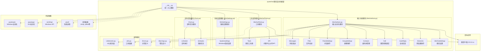

# pywechat🥇

## 🍬🍬全网最强微信RPA!
### pywechat是一个基于pywinauto实现的Windows系统下PC微信自动化的Python项目。基本实现了PC微信内置的所有功能,支持单线程多任务轮流进行!!

### 微信版本:3.9.12.xx
### 操作系统:🪟windows 10 🪟windows 11
### python版本🐍:3.x
### 支持语言:简体中文,English,繁体中文
### pywechat项目结构：

<br>
 ## 新版本pywechat内所有模块下的类或函数均可直接从pywechat导入，使用两行代码即可实现从自动登录到自动回复的一系列微信自动化之旅。🗺️🗺️
   ```
  from pywechat import xx(class)
  from pywechat import xx(function)
  ```
<br>

### 注意:针对未登录的情况,pywechat最新版本会通过查询环境变量,注册表等一些方法尽可能地自动找到微信路径,除非你的微信路径手动修改过,发生了变动的话可能需要将微信路径加入到环境变量或手动传入

<br>

### 获取方法:
#### 最新版本:1.9.7
```
pip install pywechat127==1.9.7
```
<br>

```
pip install --upgrade pywechat127
```
<br>

### 添加微信至windows用户环境变量:
#### pywechat已内置自动添加微信至用户环境变量的方法,运行下列代码即可自动添加微信路径至windows用户变量 :
```
from pywechat.WechatTools import Tools
Tools.set_wechat_as_environ_path()
```

#### 效果演示:

<br>

### WechatTools🌪️🌪️
#### 模块包括:
#### Tools:关于PC微信的一些工具,包括打开PC微信内各个界面的open系列方法。
#### API:打开指定微信小程序，指定公众号,打开视频号的功能，若有其他开发者想自动化操作上述程序可调用此API。
#### 函数:该模块内所有函数与方法一致。
<br>

### WechatAuto🛏️🛏️
#### 模块包括：
##### Messages: 5种类型的发送消息方法，包括:单人单条,单人多条,多人单条,多人多条,转发消息:多人同一条。 
##### Files: 5种类型的发送文件方法，包括:单人单个,单人多个,多人单个,多人多个,转发文件:多人同一个。发送多个文件时，你只需将所有文件放入文件夹内，将文件夹路径传入即可。
##### FriendSettings: 涵盖了PC微信针对某个好友的全部操作的方法。
##### GroupSettings: 涵盖了PC微信针对某个群聊的全部操作的方法。
##### Contacts: 获取3种类型通讯录好友的备注与昵称包括:微信好友,企业号微信,群聊名称与人数，数据返回格式为json。
##### Call: 给某个好友打视频或语音电话。
##### AutoReply:自动接听微信视频或语音电话,自动回复指定好友消息,自动回复所有好友消息。
#### Moments:针对微信朋友圈的一些方法,包括数据爬取，图片视频导出
#### 函数:该模块内所有函数与方法一致。  
<br>

### WinSettings🔹🔹
#### 模块包括：
#### Systemsettings:该模块中提供了一些修改windows系统设置的方法。
#### 函数：该模块内所有函数与方法一致。
<br>

### 使用示例:
#### 所有自动化操作只需两行代码即可实现，即：
```
from pywechat import xxx
xxx
```
#### (注意，微信WeChat.exe路径已添加至windows系统环境变量,故当微信还未登录时,以下方法或函数无需传入wechat_path这一参数)
<br>

#### 在某个群聊自动回复(使用装饰器自定义回复内容)
```
from pywechat.utils import auto_reply_to_group_decorator
@auto_reply_to_group_decorator(duration='2min',group_name='Pywechat测试群',at_only=True,at_other=True)
def reply_func(newMessage):
    if '你好' in newMessage:
        return '你好,请问有什么可以帮您的吗?'
    if '在吗' in newMessage:
        return '在的,请问有什么可以帮您的吗?'
    if '售后' in newMessage:
        return '''您好，您可以点击下方链接申请售后:
        https://github.com/Hello-Mr-Crab/pywechat'''
    if '算了' in newMessage or '不需要了' in newMessage:
        return '不好意思.未能为您提供满意的服务,欢迎下次光临'
    return '不好意思，未能理解您的需求'#最后总是要返回一个值，不要出现newMessage不在列举的情况,返回None
reply_func()
```


<br>
#### 监听某个群聊或好友的窗口(自动保存聊天文件与图片和视频)
```
from pywechat import listen_on_chat
filesave_folder=r"E:\Desktop\保存文件"
mediasave_folder=r"E:\Desktop\聊天图片与视频保存"
contents,senders,types=listen_on_chat(friend='测试群',duration='10min',save_file=True,file_folder=filesave_folder,save_media=True,media_folder=mediasave_folder)
print(contents,senders,types)
```
#### 朋友圈数据获取
```
from pywechat import dump_recent_moments
moments=dump_recent_moments(recent='Today')
for dict in moments:
    print(dict)
```


<br>
##### 注意，导出的结果为list[dict],每一条朋友圈对应一个dict,dict具体内容为:
{'好友备注':'','发布时间':'','文本内容':'','点赞者':'','评论内容':'','图片数量':'','视频数量':'','卡片链接':'','卡片链接内容':'','视频号':'','公众号链接内容':''}
#### 朋友圈图片导出
```
from pywechat import export_recent_moments_images
export_recent_moments_images(recent='Today')
```


<br>
#### 监听整个会话列表内所有好友的新消息(自动保存聊天文件)
```
from pywechat import check_new_message
filesave_folder=r"E:\Desktop\文件保存"
newMessages=check_new_message(duration='5min',save_file=True,target_folder=filesave_folder)
#newMessages是[{'好友名称':'路人甲','好友类型':'群聊,好友或公众号','新消息条数':xx,'消息内容':[],'消息类型':[]}]
#格式的list[dict]
```
##### 运行效果可查看
https://blog.csdn.net/weixin_73953650/article/details/148619622?spm=1001.2014.3001.5501

#### 转发与某个好友的一定数量文件给其他好友
 ```
 #注意:微信转发消息单次上线为9,pywechat内转发消息,文件,链接,小程序等支持多个好友按9个为一组分批发送
 from pywechat import forward_files
 others=['路人甲','路人乙','路人丙','路人丁']
 forward_files(friend='测试群',others=others,number=20)
 ```
#### 保存指定数量聊天文件到本地]
```
from pywechat import save_files
folder_path=r'E:\Desktop\新建文件夹'
save_files(friend='测试群',number=20,folder_path=folder_path)
```
#### 群聊内自动回复(被@时触发)
```
from pywechat import auto_reply_to_group
auto_reply_to_group(group_name='测试群',duration='20min',content='我被@了',at_only=True,at_others=True)
```


<br>
#### 给某个好友发送多条信息：
```
from pywechat.WechatAuto import Messages
Messages.send_messages_to_friend(friend="文件传输助手",messages=['你好','我正在使用pywechat操控微信给你发消息','收到请回复'])
```
##### 或者
```
import pywechat.WechatAuto as wechat
wechat.send_messages_to_friend(friend="文件传输助手",messages=['你好','我正在使用pywechat操控微信给你发消息','收到请回复'])
```
<br>

#### 自动接听语音视频电话:
```
from pywechat.WechatAuto import AutoReply
AutoReply.auto_answer_call(broadcast_content='您好，我目前不在线我的PC微信正在由我的微信机器人控制请稍后再试',message='您好，我目前不在线我的PC微信正在由我的微信机器人控制请稍后再试',duration='1h',times=1)
```
##### 或者
```
import pywechat.WechatAuto as wechat
wechat.auto_answer_call(broadcast_content='您好，我目前不在线我的PC微信正在由我的微信机器人控制请稍后再试',message='您好，我目前不在线我的PC微信正在由我的微信机器人控制请稍后再试',duration='1h',times=1)
```
### 多任务使用示例
#### 注意,微信不支持多线程，只支持单线程多任务轮流执行，pywechat也支持单线程多任务轮流执行，在运行多个实例时尽量请将所有函数与方法内的close_wechat参数设为False(默认为True)
#### 这样只需要打开一次微信，多个任务便可以共享资源,更加高效，否则，每个实例在运行时都会重启一次微信，较为低效。
#### 注意,不要对pywechat内函数或方法使用多线程,因为微信只能打开一个,多个线程同时操作一个微信界面,必然产生死锁,会导致界面卡死!
<br>

```
from pywechat.WechatAuto import Messages,Files
Messages.send_messages_to_friend(friend='好友1',messages=['在测试','ok'],close_wechat=False)
Files.send_files_to_friend(friend='文件传输助手',folder_path=r"E:\OneDrive\Desktop\测试专用",with_messages=True,messages_first=True,messages=['在测试文件消息一起发，你应该先看到这条消息，后看到文件'],close_wechat=True)
```
#### 效果演示:


<br>

##### 自动回复效果:


### 检查新消息示例
<br>

```
from pywechat import check_new_message
print(check_new_message())
```

##### 检查新消息效果：


##### 若你开启了语音自动转消息功能后,新消息中含有语音消息的话,可以将其转换结果一并记录。（1.9.7版本支持此功能）
## 注意:
👎👎请勿将pywechat用于任何非法商业活动,因此造成的一切后果由使用者自行承担！ 

###### 作者CSDN主页:https://blog.csdn.net/weixin_73953650?spm=1011.2415.3001.5343


##### 原始项目的基础内容分析


          
我需要先整体了解这个微信自动化项目的结构，然后分析各个模块的功能和关系，最后绘制架构图。让我先查看项目的主要文件和目录结构。
        
            
toolName: view_files
            
status: success
          
            
filePath: g:\wxrobot\pywechat-main\README.md
g:\wxrobot\pywechat-main\setup.py
g:\wxrobot\pywechat-main\requirements.txt
          
现在我需要查看主要的模块文件来了解项目的核心架构，特别是pywechat目录下的主要文件。
        
            
toolName: view_files
            
status: success
          
            
filePath: g:\wxrobot\pywechat-main\pywechat\__init__.py
g:\wxrobot\pywechat-main\pywechat\WechatAuto.py
g:\wxrobot\pywechat-main\pywechat\WechatTools.py
          
现在我需要查看其他重要的模块文件来完善对项目架构的理解。
        
            
toolName: view_files
            
status: success
          
            
filePath: g:\wxrobot\pywechat-main\pywechat\WinSettings.py
g:\wxrobot\pywechat-main\pywechat\Uielements.py
g:\wxrobot\pywechat-main\pywechat\utils.py
          
现在我需要查看Clock.py和Errors.py等其他重要文件来完善架构理解。
        
            
toolName: view_files
            
status: success
          
            
filePath: g:\wxrobot\pywechat-main\pywechat\Clock.py
g:\wxrobot\pywechat-main\pywechat\Errors.py
g:\wxrobot\pywechat-main\pywechat\Warnings.py
          
我已经详细阅读了这个pywechat项目，这是一个基于pywinauto实现的Windows系统下PC微信自动化的Python项目。下面是项目的架构图：



## 项目架构说明

### 🏗️ 整体架构
这个项目采用模块化设计，主要分为以下几个层次：

### 📦 核心模块

1. **WechatAuto.py** - 核心自动化模块
   - `Messages`: 5种消息发送方式（单人单条、单人多条、多人单条、多人多条、转发消息）
   - `Files`: 5种文件发送方式（单人单个、单人多个、多人单个、多人多个、转发文件）
   - `FriendSettings`: 好友相关的所有操作
   - `GroupSettings`: 群聊相关的所有操作
   - `Contacts`: 通讯录管理（获取好友信息、群聊信息等）
   - `Call`: 语音视频通话功能
   - `AutoReply`: 自动回复功能
   - `Moments`: 朋友圈操作（数据爬取、图片视频导出）
   - `WeChatSettings`: 微信设置修改

2. **WechatTools.py** - 工具模块
   - `Tools`: 微信相关工具类（检测运行状态、打开界面等）
   - `API`: 小程序、公众号、视频号操作API

3. **WinSettings.py** - 系统设置模块
   - `Systemsettings`: Windows系统设置操作

4. **Clock.py** - 定时任务模块
   - `schedule`: 定时执行功能
   - `Schtasks`: Windows系统任务管理

### 🔧 支持模块

- **Uielements.py**: UI元素封装，支持多语言（简体中文、繁体中文、英文）
- **utils.py**: 工具函数和装饰器（如自动回复装饰器）
- **Errors.py**: 自定义异常类
- **Warnings.py**: 警告类定义

### 🎯 设计特点

1. **统一入口**: 通过`__init__.py`提供统一的导入接口
2. **模块化设计**: 功能按类别清晰分离
3. **多语言支持**: 自动检测微信语言版本
4. **装饰器模式**: 提供便捷的自动回复装饰器
5. **异常处理**: 完善的错误和警告机制
6. **跨平台兼容**: 支持Windows 10/11系统

### 🔗 依赖关系

项目主要依赖于：
- `pywinauto`: Windows应用程序自动化
- `pyautogui`: GUI自动化操作
- `win32api`: Windows系统API调用
- `psutil`: 系统进程管理
- 其他工具库：emoji、pillow等

这个架构设计使得用户只需要两行代码就能实现复杂的微信自动化操作，体现了良好的封装性和易用性。
        

