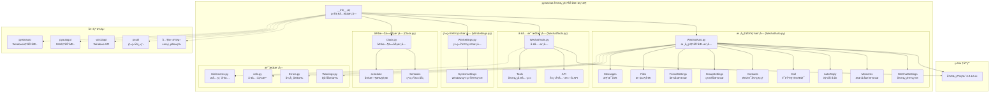

# pywechat🥇

## ğŸ¬ğŸ¬å…¨ç½‘最强微信RPA!
### pywechat是一个基äºpywinautoå®ç°çš„Windows系统下PC微信自动化的Python项目。基本å®ç°äº†PC微信内置的所有功能,支æŒå•çº¿ç¨‹å¤šä»»åŠ¡è½®æµè¿›è¡Œ!!

### 微信版本:3.9.12.xx
### æ“作系统:🪟windows 10 🪟windows 11
### python版本ğŸ:3.x
### 支æŒè¯­è¨€:简体中文,English,ç¹ä½“中文
### pywechat项目结æ„：

<br>
 ## 新版本pywechat内所有模å—下的类或函数å‡å¯ç›´æ¥ä»pywechat导入，使用两行代ç å³å¯å®ç°ä»è‡ªåŠ¨ç™»å½•åˆ°è‡ªåŠ¨å›å¤çš„一系列微信自动化之旅。🗺ï¸ğŸ—ºï¸
   ```
  from pywechat import xx(class)
  from pywechat import xx(function)
  ```
<br>

### 注æ„:针对未登录的情况,pywechat最新版本会通过查询ç¯å¢ƒå˜é‡,注册表等一些方法尽å¯èƒ½åœ°è‡ªåŠ¨æ‰¾åˆ°å¾®ä¿¡è·¯å¾„,除é你的微信路径手动修改过,å‘生了å˜åŠ¨çš„è¯å¯èƒ½éœ€è¦å°†å¾®ä¿¡è·¯å¾„加入到ç¯å¢ƒå˜é‡æˆ–手动传入

<br>

### è·å–方法:
#### 最新版本:1.9.7
```
pip install pywechat127==1.9.7
```
<br>

```
pip install --upgrade pywechat127
```
<br>

### 添加微信至windows用户ç¯å¢ƒå˜é‡:
#### pywechat已内置自动添加微信至用户ç¯å¢ƒå˜é‡çš„方法,è¿è¡Œä¸‹åˆ—代ç å³å¯è‡ªåŠ¨æ·»åŠ å¾®ä¿¡è·¯å¾„至windows用户å˜é‡ :
```
from pywechat.WechatTools import Tools
Tools.set_wechat_as_environ_path()
```

#### 效æœæ¼”示:

<br>

### WechatTools🌪ï¸ğŸŒªï¸
#### 模å—包括:
#### Tools:å…³äºPC微信的一些工具,包括打开PC微信内å„个界é¢çš„open系列方法。
#### API:打开指定微信å°ç¨‹åºï¼ŒæŒ‡å®šå…¬ä¼—å·,打开视频å·çš„功能，若有其他开å‘者想自动化æ“作上述程åºå¯è°ƒç”¨æ­¤API。
#### 函数:该模å—内所有函数ä¸æ–¹æ³•ä¸€è‡´ã€‚
<br>

### WechatAutoğŸ›ï¸ğŸ›ï¸
#### 模å—包括：
##### Messages: 5ç§ç±»å‹çš„å‘é€æ¶ˆæ¯æ–¹æ³•ï¼ŒåŒ…括:å•äººå•æ¡,å•äººå¤šæ¡,多人å•æ¡,多人多æ¡,转å‘消æ¯:多人åŒä¸€æ¡ã€‚ 
##### Files: 5ç§ç±»å‹çš„å‘é€æ–‡ä»¶æ–¹æ³•ï¼ŒåŒ…括:å•äººå•ä¸ª,å•äººå¤šä¸ª,多人å•ä¸ª,多人多个,转å‘文件:多人åŒä¸€ä¸ªã€‚å‘é€å¤šä¸ªæ–‡ä»¶æ—¶ï¼Œä½ åªéœ€å°†æ‰€æœ‰æ–‡ä»¶æ”¾å…¥æ–‡ä»¶å¤¹å†…，将文件夹路径传入å³å¯ã€‚
##### FriendSettings: 涵盖了PC微信针对æŸä¸ªå¥½å‹çš„全部æ“作的方法。
##### GroupSettings: 涵盖了PC微信针对æŸä¸ªç¾¤èŠçš„全部æ“作的方法。
##### Contacts: è·å–3ç§ç±»å‹é€šè®¯å½•å¥½å‹çš„备注ä¸æ˜µç§°åŒ…括:微信好å‹,ä¼ä¸šå·å¾®ä¿¡,群èŠå称ä¸äººæ•°ï¼Œæ•°æ®è¿”å›æ ¼å¼ä¸ºjson。
##### Call: ç»™æŸä¸ªå¥½å‹æ‰“视频或语音电è¯ã€‚
##### AutoReply:自动æ¥å¬å¾®ä¿¡è§†é¢‘或语音电è¯,自动å›å¤æŒ‡å®šå¥½å‹æ¶ˆæ¯,自动å›å¤æ‰€æœ‰å¥½å‹æ¶ˆæ¯ã€‚
#### Moments:针对微信朋å‹åœˆçš„一些方法,包括数æ®çˆ¬å–，图片视频导出
#### 函数:该模å—内所有函数ä¸æ–¹æ³•ä¸€è‡´ã€‚  
<br>

### WinSettings🔹🔹
#### 模å—包括：
#### Systemsettings:该模å—中æ供了一些修改windows系统设置的方法。
#### 函数：该模å—内所有函数ä¸æ–¹æ³•ä¸€è‡´ã€‚
<br>

### 使用示例:
#### 所有自动化æ“作åªéœ€ä¸¤è¡Œä»£ç å³å¯å®ç°ï¼Œå³ï¼š
```
from pywechat import xxx
xxx
```
#### (注æ„，微信WeChat.exe路径已添加至windows系统ç¯å¢ƒå˜é‡,故当微信还未登录时,以下方法或函数无需传入wechat_path这一å‚æ•°)
<br>

#### 在æŸä¸ªç¾¤èŠè‡ªåŠ¨å›å¤(使用装饰器自定义å›å¤å†…容)
```
from pywechat.utils import auto_reply_to_group_decorator
@auto_reply_to_group_decorator(duration='2min',group_name='Pywechat测试群',at_only=True,at_other=True)
def reply_func(newMessage):
    if '你好' in newMessage:
        return '你好,请问有什么å¯ä»¥å¸®æ‚¨çš„å—?'
    if '在å—' in newMessage:
        return '在的,请问有什么å¯ä»¥å¸®æ‚¨çš„å—?'
    if 'å”®å' in newMessage:
        return '''您好，您å¯ä»¥ç‚¹å‡»ä¸‹æ–¹é“¾æ¥ç”³è¯·å”®å:
        https://github.com/Hello-Mr-Crab/pywechat'''
    if '算了' in newMessage or 'ä¸éœ€è¦äº†' in newMessage:
        return 'ä¸å¥½æ„æ€.未能为您æ供满æ„çš„æœåŠ¡,欢è¿ä¸‹æ¬¡å…‰ä¸´'
    return 'ä¸å¥½æ„æ€ï¼Œæœªèƒ½ç†è§£æ‚¨çš„需求'#最å总是è¦è¿”å›ä¸€ä¸ªå€¼ï¼Œä¸è¦å‡ºç°newMessageä¸åœ¨åˆ—举的情况,è¿”å›None
reply_func()
```


<br>
#### 监å¬æŸä¸ªç¾¤èŠæˆ–好å‹çš„窗å£(自动ä¿å­˜èŠå¤©æ–‡ä»¶ä¸å›¾ç‰‡å’Œè§†é¢‘)
```
from pywechat import listen_on_chat
filesave_folder=r"E:\Desktop\ä¿å­˜æ–‡ä»¶"
mediasave_folder=r"E:\Desktop\èŠå¤©å›¾ç‰‡ä¸è§†é¢‘ä¿å­˜"
contents,senders,types=listen_on_chat(friend='测试群',duration='10min',save_file=True,file_folder=filesave_folder,save_media=True,media_folder=mediasave_folder)
print(contents,senders,types)
```
#### 朋å‹åœˆæ•°æ®è·å–
```
from pywechat import dump_recent_moments
moments=dump_recent_moments(recent='Today')
for dict in moments:
    print(dict)
```


<br>
##### 注æ„，导出的结æœä¸ºlist[dict],æ¯ä¸€æ¡æœ‹å‹åœˆå¯¹åº”一个dict,dict具体内容为:
{'好å‹å¤‡æ³¨':'','å‘布时间':'','文本内容':'','点èµè€…':'','评论内容':'','图片数é‡':'','视频数é‡':'','å¡ç‰‡é“¾æ¥':'','å¡ç‰‡é“¾æ¥å†…容':'','视频å·':'','公众å·é“¾æ¥å†…容':''}
#### 朋å‹åœˆå›¾ç‰‡å¯¼å‡º
```
from pywechat import export_recent_moments_images
export_recent_moments_images(recent='Today')
```


<br>
#### 监å¬æ•´ä¸ªä¼šè¯åˆ—表内所有好å‹çš„新消æ¯(自动ä¿å­˜èŠå¤©æ–‡ä»¶)
```
from pywechat import check_new_message
filesave_folder=r"E:\Desktop\文件ä¿å­˜"
newMessages=check_new_message(duration='5min',save_file=True,target_folder=filesave_folder)
#newMessages是[{'好å‹å称':'路人甲','好å‹ç±»å‹':'群èŠ,好å‹æˆ–公众å·','新消æ¯æ¡æ•°':xx,'消æ¯å†…容':[],'消æ¯ç±»å‹':[]}]
#æ ¼å¼çš„list[dict]
```
##### è¿è¡Œæ•ˆæœå¯æŸ¥çœ‹
https://blog.csdn.net/weixin_73953650/article/details/148619622?spm=1001.2014.3001.5501

#### 转å‘ä¸æŸä¸ªå¥½å‹çš„一定数é‡æ–‡ä»¶ç»™å…¶ä»–好å‹
 ```
 #注æ„:微信转å‘消æ¯å•æ¬¡ä¸Šçº¿ä¸º9,pywechat内转å‘消æ¯,文件,链æ¥,å°ç¨‹åºç­‰æ”¯æŒå¤šä¸ªå¥½å‹æŒ‰9个为一组分批å‘é€
 from pywechat import forward_files
 others=['路人甲','路人乙','路人丙','路人ä¸']
 forward_files(friend='测试群',others=others,number=20)
 ```
#### ä¿å­˜æŒ‡å®šæ•°é‡èŠå¤©æ–‡ä»¶åˆ°æœ¬åœ°]
```
from pywechat import save_files
folder_path=r'E:\Desktop\新建文件夹'
save_files(friend='测试群',number=20,folder_path=folder_path)
```
#### 群èŠå†…自动å›å¤(被@时触å‘)
```
from pywechat import auto_reply_to_group
auto_reply_to_group(group_name='测试群',duration='20min',content='我被@了',at_only=True,at_others=True)
```


<br>
#### ç»™æŸä¸ªå¥½å‹å‘é€å¤šæ¡ä¿¡æ¯ï¼š
```
from pywechat.WechatAuto import Messages
Messages.send_messages_to_friend(friend="文件传输助手",messages=['你好','我正在使用pywechatæ“æ§å¾®ä¿¡ç»™ä½ å‘消æ¯','收到请å›å¤'])
```
##### 或者
```
import pywechat.WechatAuto as wechat
wechat.send_messages_to_friend(friend="文件传输助手",messages=['你好','我正在使用pywechatæ“æ§å¾®ä¿¡ç»™ä½ å‘消æ¯','收到请å›å¤'])
```
<br>

#### 自动æ¥å¬è¯­éŸ³è§†é¢‘电è¯:
```
from pywechat.WechatAuto import AutoReply
AutoReply.auto_answer_call(broadcast_content='您好，我目å‰ä¸åœ¨çº¿æˆ‘çš„PC微信正在由我的微信机器人æ§åˆ¶è¯·ç¨åå†è¯•',message='您好，我目å‰ä¸åœ¨çº¿æˆ‘çš„PC微信正在由我的微信机器人æ§åˆ¶è¯·ç¨åå†è¯•',duration='1h',times=1)
```
##### 或者
```
import pywechat.WechatAuto as wechat
wechat.auto_answer_call(broadcast_content='您好，我目å‰ä¸åœ¨çº¿æˆ‘çš„PC微信正在由我的微信机器人æ§åˆ¶è¯·ç¨åå†è¯•',message='您好，我目å‰ä¸åœ¨çº¿æˆ‘çš„PC微信正在由我的微信机器人æ§åˆ¶è¯·ç¨åå†è¯•',duration='1h',times=1)
```
### 多任务使用示例
#### 注æ„,微信ä¸æ”¯æŒå¤šçº¿ç¨‹ï¼Œåªæ”¯æŒå•çº¿ç¨‹å¤šä»»åŠ¡è½®æµæ‰§è¡Œï¼Œpywechat也支æŒå•çº¿ç¨‹å¤šä»»åŠ¡è½®æµæ‰§è¡Œï¼Œåœ¨è¿è¡Œå¤šä¸ªå®ä¾‹æ—¶å°½é‡è¯·å°†æ‰€æœ‰å‡½æ•°ä¸æ–¹æ³•å†…çš„close_wechatå‚数设为False(默认为True)
#### 这样åªéœ€è¦æ‰“开一次微信，多个任务便å¯ä»¥å…±äº«èµ„æº,更加高效，å¦åˆ™ï¼Œæ¯ä¸ªå®ä¾‹åœ¨è¿è¡Œæ—¶éƒ½ä¼šé‡å¯ä¸€æ¬¡å¾®ä¿¡ï¼Œè¾ƒä¸ºä½æ•ˆã€‚
#### 注æ„,ä¸è¦å¯¹pywechat内函数或方法使用多线程,因为微信åªèƒ½æ‰“开一个,多个线程åŒæ—¶æ“作一个微信界é¢,必然产生死é”,会导致界é¢å¡æ­»!
<br>

```
from pywechat.WechatAuto import Messages,Files
Messages.send_messages_to_friend(friend='好å‹1',messages=['在测试','ok'],close_wechat=False)
Files.send_files_to_friend(friend='文件传输助手',folder_path=r"E:\OneDrive\Desktop\测试专用",with_messages=True,messages_first=True,messages=['在测试文件消æ¯ä¸€èµ·å‘，你应该先看到这æ¡æ¶ˆæ¯ï¼Œå看到文件'],close_wechat=True)
```
#### 效æœæ¼”示:


<br>

##### 自动å›å¤æ•ˆæœ:


### 检查新消æ¯ç¤ºä¾‹
<br>

```
from pywechat import check_new_message
print(check_new_message())
```

##### 检查新消æ¯æ•ˆæœï¼š


##### 若你开å¯äº†è¯­éŸ³è‡ªåŠ¨è½¬æ¶ˆæ¯åŠŸèƒ½å,新消æ¯ä¸­å«æœ‰è¯­éŸ³æ¶ˆæ¯çš„è¯,å¯ä»¥å°†å…¶è½¬æ¢ç»“æœä¸€å¹¶è®°å½•ã€‚（1.9.7版本支æŒæ­¤åŠŸèƒ½ï¼‰
## 注æ„:
ğŸ‘ğŸ‘请勿将pywechat用äºä»»ä½•é法商业活动,因此造æˆçš„一切åæœç”±ä½¿ç”¨è€…è‡ªè¡Œæ‰¿æ‹…ï¼ 

###### 作者CSDN主页:https://blog.csdn.net/weixin_73953650?spm=1011.2415.3001.5343


##### åŸå§‹é¡¹ç›®çš„基础内容分æ


          
我需è¦å…ˆæ•´ä½“了解这个微信自动化项目的结æ„，然å分æå„个模å—的功能和关系，最å绘制æ¶æ„图。让我先查看项目的主è¦æ–‡ä»¶å’Œç›®å½•ç»“æ„。
        
            
toolName: view_files
            
status: success
          
            
filePath: g:\wxrobot\pywechat-main\README.md
g:\wxrobot\pywechat-main\setup.py
g:\wxrobot\pywechat-main\requirements.txt
          
ç°åœ¨æˆ‘需è¦æŸ¥çœ‹ä¸»è¦çš„模å—文件æ¥äº†è§£é¡¹ç›®çš„核心æ¶æ„，特别是pywechat目录下的主è¦æ–‡ä»¶ã€‚
        
            
toolName: view_files
            
status: success
          
            
filePath: g:\wxrobot\pywechat-main\pywechat\__init__.py
g:\wxrobot\pywechat-main\pywechat\WechatAuto.py
g:\wxrobot\pywechat-main\pywechat\WechatTools.py
          
ç°åœ¨æˆ‘需è¦æŸ¥çœ‹å…¶ä»–é‡è¦çš„模å—文件æ¥å®Œå–„对项目æ¶æ„çš„ç†è§£ã€‚
        
            
toolName: view_files
            
status: success
          
            
filePath: g:\wxrobot\pywechat-main\pywechat\WinSettings.py
g:\wxrobot\pywechat-main\pywechat\Uielements.py
g:\wxrobot\pywechat-main\pywechat\utils.py
          
ç°åœ¨æˆ‘需è¦æŸ¥çœ‹Clock.pyå’ŒErrors.py等其他é‡è¦æ–‡ä»¶æ¥å®Œå–„æ¶æ„ç†è§£ã€‚
        
            
toolName: view_files
            
status: success
          
            
filePath: g:\wxrobot\pywechat-main\pywechat\Clock.py
g:\wxrobot\pywechat-main\pywechat\Errors.py
g:\wxrobot\pywechat-main\pywechat\Warnings.py
          
我已ç»è¯¦ç»†é˜…读了这个pywechat项目，这是一个基äºpywinautoå®ç°çš„Windows系统下PC微信自动化的Python项目。下é¢æ˜¯é¡¹ç›®çš„æ¶æ„图：



## 项目æ¶æ„说æ˜

### ğŸ—ï¸ æ•´ä½“æ¶æ„
这个项目采用模å—化设计，主è¦åˆ†ä¸ºä»¥ä¸‹å‡ ä¸ªå±‚次：

### 📦 核心模å—

1. **WechatAuto.py** - 核心自动化模å—
   - `Messages`: 5ç§æ¶ˆæ¯å‘é€æ–¹å¼ï¼ˆå•äººå•æ¡ã€å•äººå¤šæ¡ã€å¤šäººå•æ¡ã€å¤šäººå¤šæ¡ã€è½¬å‘消æ¯ï¼‰
   - `Files`: 5ç§æ–‡ä»¶å‘é€æ–¹å¼ï¼ˆå•äººå•ä¸ªã€å•äººå¤šä¸ªã€å¤šäººå•ä¸ªã€å¤šäººå¤šä¸ªã€è½¬å‘文件）
   - `FriendSettings`: 好å‹ç›¸å…³çš„所有æ“作
   - `GroupSettings`: 群èŠç›¸å…³çš„所有æ“作
   - `Contacts`: 通讯录管ç†ï¼ˆè·å–好å‹ä¿¡æ¯ã€ç¾¤èŠä¿¡æ¯ç­‰ï¼‰
   - `Call`: 语音视频通è¯åŠŸèƒ½
   - `AutoReply`: 自动å›å¤åŠŸèƒ½
   - `Moments`: 朋å‹åœˆæ“作（数æ®çˆ¬å–ã€å›¾ç‰‡è§†é¢‘导出）
   - `WeChatSettings`: 微信设置修改

2. **WechatTools.py** - 工具模å—
   - `Tools`: 微信相关工具类（检测è¿è¡ŒçŠ¶æ€ã€æ‰“开界é¢ç­‰ï¼‰
   - `API`: å°ç¨‹åºã€å…¬ä¼—å·ã€è§†é¢‘å·æ“作API

3. **WinSettings.py** - 系统设置模å—
   - `Systemsettings`: Windows系统设置æ“作

4. **Clock.py** - 定时任务模å—
   - `schedule`: 定时执行功能
   - `Schtasks`: Windows系统任务管ç†

### 🔧 支æŒæ¨¡å—

- **Uielements.py**: UI元素å°è£…，支æŒå¤šè¯­è¨€ï¼ˆç®€ä½“中文ã€ç¹ä½“中文ã€è‹±æ–‡ï¼‰
- **utils.py**: 工具函数和装饰器（如自动å›å¤è£…饰器）
- **Errors.py**: 自定义异常类
- **Warnings.py**: 警告类定义

### 🯠设计特点

1. **统一入å£**: 通过`__init__.py`æ供统一的导入æ¥å£
2. **模å—化设计**: 功能按类别清晰分离
3. **多语言支æŒ**: 自动检测微信语言版本
4. **装饰器模å¼**: æ供便æ·çš„自动å›å¤è£…饰器
5. **异常处ç†**: 完善的错误和警告机制
6. **跨平å°å…¼å®¹**: 支æŒWindows 10/11系统

### 🔗 ä¾èµ–关系

项目主è¦ä¾èµ–äºï¼š
- `pywinauto`: Windows应用程åºè‡ªåŠ¨åŒ–
- `pyautogui`: GUI自动化æ“作
- `win32api`: Windows系统API调用
- `psutil`: 系统进程管ç†
- 其他工具库：emojiã€pillowç­‰

这个æ¶æ„设计使得用户åªéœ€è¦ä¸¤è¡Œä»£ç å°±èƒ½å®ç°å¤æ‚的微信自动化æ“作，体ç°äº†è‰¯å¥½çš„å°è£…性和易用性。
        

